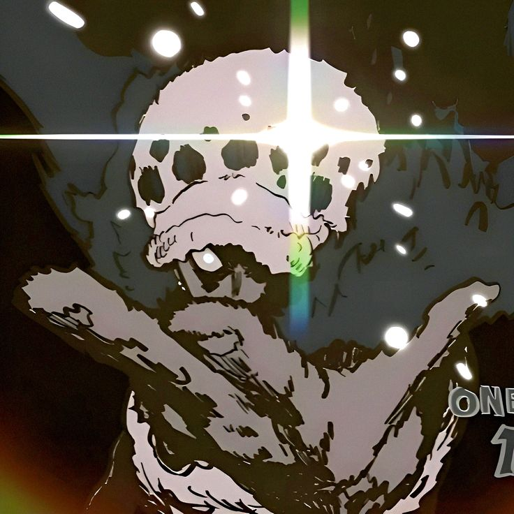

```zsh
Sen@linux: ~/my_readme $ neofetch
```


```csharp
---------------------------------------------------------------
Username: Sengmonkham
Interests: Open Source, Competitive Programming, Distributed Systems 
OS: MacOS / NixOS
Uptime: Too long
Packages: Autism, ADHD, and Coffee
Terminal: Ghostty
Languages: Rust, TypeScript, C++
Tools: Yabai, Hyperland, Skhd, tmux, nvim
Status: Locked in
---------------------------------------------------------------
```

<br clear="both"/>


```zsh
Sen@linux: ~/my_readme $ ./show-oss-contributions
```
<div align="center">
Below are some of my pull requests to various open source organizations.

| # | Organization | Repository | PR | Status |
|---|---|---|---|---|
| 1 | [BeagleBoard](https://github.com/beagleboard) | [bb-imager-rs](https://github.com/beagleboard/bb-imager-rs) | [#221](https://github.com/beagleboard/bb-imager-rs/pull/221) | Merged |
| 2 | [Rust Lang](https://github.com/rust-lang) | [rust-clippy](https://github.com/rust-lang/rust-clippy) | [#16605](https://github.com/rust-lang/rust-clippy/pull/16605) | Merged |
| 3 | [Rust Lang](https://github.com/rust-lang) | [rust-clippy](https://github.com/rust-lang/rust-clippy) | [#16652](https://github.com/rust-lang/rust-clippy/pull/16652) | Merged |
| 4 | [Rust Lang](https://github.com/rust-lang) | [rust-analyzer](https://github.com/rust-lang/rust-analyzer) | [#21843](https://github.com/rust-lang/rust-analyzer/pull/21843) | Merged |

</div>

<br/>

```zsh
Sen@linux: ~/my_readme $ ./show-github-stats
```

<div align="center">
  
  
</div>

<div align="center">
  
</div>

<br/>


<div align="center">
  <br />
  
</div>
